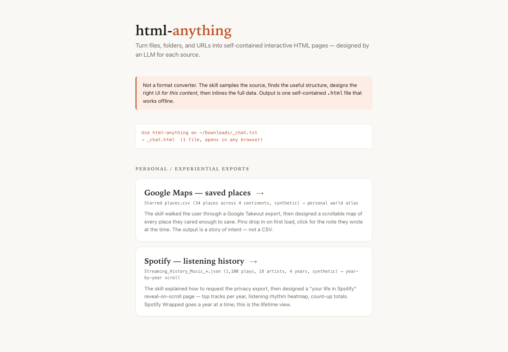

# html-anything

> Raw files in. One useful HTML page out.

[](https://skills.sh/clockless-org/html-anything)

html-anything is an Agent Skill that turns files, folders, and URLs into a
single self-contained interactive HTML page.

It is not a format converter. The agent samples the source, finds the
structure, designs the page, and inlines the full data so the result works
offline.

Use it for:

```text
CSV / TSV             -> dashboard, charts, outliers, searchable rows
PDF / DOCX / Markdown -> summary, claim cards, reading view
WhatsApp / Slack      -> timelines, topic clusters, searchable messages
Spotify / Twitch      -> year-in-review style personal history
Google Maps stars     -> personal atlas of saved places
CI logs / stack traces -> failure map, hypotheses, ticket notes
Notes folders         -> concept map, hubs, stale notes, TODOs
```

One command to install. One sentence to use. One HTML file at the end.

---

## Preview

[Open the live examples](https://clockless-org.github.io/html-anything/examples/)
or browse [`examples/`](./examples).

[](https://clockless-org.github.io/html-anything/examples/)

---

## Install

```bash
npx skills add clockless-org/html-anything
```

Works with any agent that supports Agent Skills.

Manual install for Codex:

```bash
mkdir -p "${CODEX_HOME:-$HOME/.codex}/skills"
git clone https://github.com/clockless-org/html-anything \
  "${CODEX_HOME:-$HOME/.codex}/skills/html-anything"
```

Manual install for Claude Code:

```bash
mkdir -p ~/.claude/skills
git clone https://github.com/clockless-org/html-anything \
  ~/.claude/skills/html-anything
```

Restart the agent after a manual install.

---

## Use

Talk to your agent:

```text
Use html-anything to turn ~/Downloads/customers.csv into an interactive HTML page.
```

```text
Make a one-page dashboard from this PDF.
```

```text
Turn my WhatsApp export into a searchable relationship timeline.
```

```text
Analyze this GitHub repo as a browsable architecture explainer:
https://github.com/clockless-org/html-anything
```

If you name a source but do not have the file yet, the skill starts with
export instructions first. For example: Spotify history, Google Maps stars,
Apple Health, WhatsApp, Twitch, and Slack.

Default output path:

```text
<input-name>.html
```

Ask for another path when you want one.

---

## Language

The README is English by default.

The skill supports Chinese. Ask in Chinese and the generated page can be in
Chinese:

```text
用 html-anything 把这个 CSV 做成中文交互式 HTML 看板。
```

```text
把我的 Spotify 历史做成年终回顾页面，中文文案。
```

---

## What It Builds

Every output is:

```text
single-file HTML
inline CSS
inline JavaScript
inline data
offline-friendly
mobile-friendly
searchable when the content has searchable records
```

No app server. No build step. No asset folder.

Open the `.html` file directly, email it, or host it as static HTML.

---

## Supported Inputs

Broad families:

| Family | Examples |
|---|---|
| Documents | PDF, DOCX, Markdown, long text |
| Tables and data | CSV, TSV, JSON, JSONL, logs |
| Conversations | WhatsApp, Slack, Discord, Telegram, iMessage-style CSV |
| Developer artifacts | git diffs, PR patches, CI logs, stack traces |
| Finance and admin | bank CSVs, invoices, QuickBooks / Xero exports |
| Planning | ICS calendars, issue tracker CSVs, Trello JSON |
| Knowledge bases | Obsidian vaults, Notion exports, Markdown folders |
| Geo and travel | GPX, KML, itineraries, location history |
| Research | bookmarks, bibliographies, reading lists, URL lists |
| Personal exports | Google Maps stars, Spotify, Twitch, Apple Health |
| URLs | GitHub repos, articles, long-form web pages |

Prompt files live in [`prompts/`](./prompts). Parser code lives in
[`src/parse/`](./src/parse).

---

## CLI

The standalone CLI uses the same prompt pack as the skill.

```bash
git clone https://github.com/clockless-org/html-anything
cd html-anything
npm install
npm run build
export ANTHROPIC_API_KEY=sk-ant-...   # or OPENAI_API_KEY=sk-...
node dist/cli.js examples/csv/input.csv --out /tmp/customers.html
```

Useful options:

```bash
node dist/cli.js <input> --out output.html
node dist/cli.js <input> --title "My Report"
node dist/cli.js <input> --model claude-sonnet-4-6
```

URL handling is best in skill mode because the agent can fetch and inspect the
page before rendering.

---

## Defaults

- The LLM only sees a representative sample.
- The full source data is injected afterward and rendered client-side.
- The generated HTML is as sensitive as the original file.
- Geo pages do not fetch map tiles.
- Research pages do not fetch saved URLs or favicons.
- Sensitive records are for organization only, not medical, legal, tax,
  accounting, immigration, or insurance advice.

---

## Add a Source

Most new sources only need a prompt.

```text
1. Add prompts/<source-name>.md
2. Describe the export path, data shape, views, and safety rules
3. Add a small synthetic example under examples/<source-name>/
4. Run npm run examples when you have an LLM API key
```

Add a parser only when deterministic preprocessing is needed: binary formats,
archives, huge files, source sniffing, or reusable summaries.

See [`docs/CONTRIBUTING.md`](./docs/CONTRIBUTING.md).

---

## 中文简介

html-anything 是一个 Agent Skill，用来把文件、文件夹或 URL 变成一个自包含的交互式 HTML 页面。

它不是普通格式转换器。它会先看数据样本，找出结构和重点，再生成适合这份内容的页面：图表、时间线、搜索、摘要、异常点、可展开明细。

安装：

```bash
npx skills add clockless-org/html-anything
```

然后直接对 agent 说：

```text
用 html-anything 把这个 PDF 做成中文 HTML 阅读页。
```

```text
把这个销售 CSV 做成一个可以搜索和筛选的中文看板。
```

输出是单个 `.html` 文件，双击就能打开。

---

## License

[Apache 2.0](./LICENSE)
