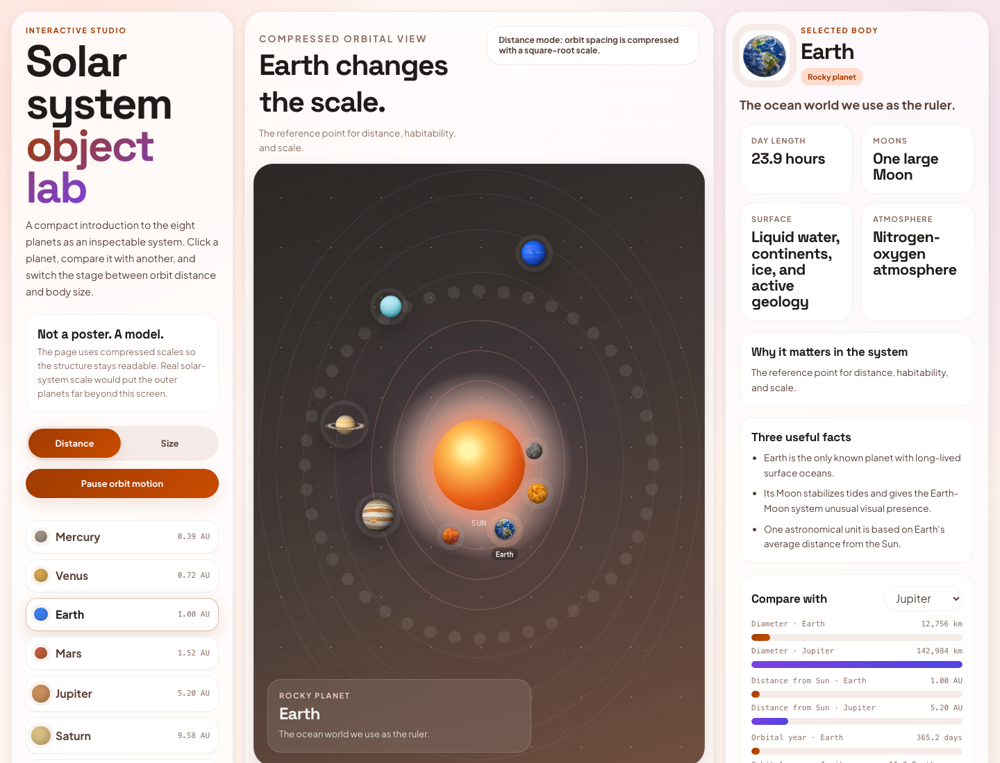

# html-anything

[](https://skills.sh/clockless-org/html-anything)

Turn an idea, file, folder, or URL into a polished live HTML page.

`html-anything` is a Codex / Claude Code skill. Give it a prompt like
"create an interactive teaching site about the solar system", or give it
an export like Amazon orders, WhatsApp chat, a CSV, a transcript, a repo,
or a folder of notes. The skill figures out the source, chooses the page
style automatically, builds the HTML, checks it in a browser, and gives
you something you can open, share, or publish.

## Preview

- [Open all live examples](https://clockless-org.github.io/html-anything/examples/)
- [Teaching style: solar system lesson](https://clockless-org.github.io/html-anything/examples/solar-system-studio/output.html)
- [Relationship report: realistic couple chat](https://clockless-org.github.io/html-anything/examples/wechat-couple/output.html)

[](https://clockless-org.github.io/html-anything/examples/solar-system-studio/output.html)

[](https://clockless-org.github.io/html-anything/examples/wechat-couple/output.html)

## Install

### Codex

```bash
mkdir -p "${CODEX_HOME:-$HOME/.codex}/skills"
git clone https://github.com/clockless-org/html-anything "${CODEX_HOME:-$HOME/.codex}/skills/html-anything"
```

Restart Codex so it loads the skill.

### Claude Code

```bash
mkdir -p ~/.claude/skills
git clone https://github.com/clockless-org/html-anything ~/.claude/skills/html-anything
```

Restart Claude Code so it loads `SKILL.md`.

### Agent Skills CLI

```bash
npx skills add clockless-org/html-anything
```

To update a manual install later:

```bash
git -C "${CODEX_HOME:-$HOME/.codex}/skills/html-anything" pull
```

## Use

Ask in plain language:

```text
Use html-anything to create an interactive teaching site about the solar system.
```

```text
Use html-anything on my Amazon order history. Walk me through the export first.
```

```text
Use html-anything to turn ~/Downloads/_chat.txt into a relationship report.
```

```text
Use html-anything to make this CSV into a shareable dashboard.
```

```text
Use html-anything on this GitHub repo URL.
```

If you already have the file, folder, or URL, give it to the agent. If
you only know the source type, such as "Amazon orders", "Spotify history",
"WhatsApp chat", or "Google Photos Takeout", the skill first explains how
to export the data, then converts it after you provide the export.

## Input And Output

| Input | What you give | What you get |
|---|---|---|
| Idea | A short brief, e.g. "make a solar system teaching site" | A generated educational / interactive HTML page |
| File | CSV, JSON, Markdown, PDF, DOCX, chat export, log, transcript, statement | A live page designed for that file |
| Folder | Notes vault, Google Photos Takeout, Notion export, repo, exported archive | A browsable atlas / dashboard / audit page |
| URL | Article, GitHub repo, public webpage | A shareable HTML reading or exploration page |
| Export request | "My Amazon orders", "my Spotify history", "my WhatsApp chat" | Export instructions first, then a live HTML page |

The output is a browser page, not markdown. Most outputs are a single
`output.html`. When the page needs generated images or other local
assets, the skill returns `output.html + assets/`. Ask for "single-file"
if you need everything in one HTML file.

## Automatic Styles

You do not need to choose a style. The default is `auto`.

The skill picks the page shape from the content:

| Content | Typical style |
|---|---|
| Unknown or mixed inputs | Default |
| Tutorials, lessons, explainers, "teach me" prompts | Teaching |
| Objects, scientific topics, product specs, system explainers | Interactive studio |
| Chats and relationship exports | Relationship report |
| Orders, finance, spreadsheets, operational data | Dashboard / personal atlas |
| Essays, reading lists, bookmarks, personal history | Editorial atlas |
| Logs, diffs, stack traces, CI failures | Developer report |
| Medical, legal, papers, long documents | Paper / review mode |

You can still steer it naturally: "make it more tutorial-like", "more
app-like", "less academic", "more dashboard-like", "more editorial", or
"more playful".

Reusable style prompts live in [`prompts/styles/`](./prompts/styles/).
There is a fallback `default` style plus eight auto-selected specialized
styles: `teaching`, `interactive-studio`, `relationship`, `dashboard`,
`personal-atlas`, `editorial`, `developer`, and `paper`.

## Source Examples

|  | Source family | Examples |
|---|---|---|
| 💾 | Personal exports | Amazon orders, YouTube watch history, Spotify history, Google Maps saved places, Apple Health, Twitch, Kindle highlights |
| 🖼️ | Photos and contacts | Google Photos Takeout metadata, vCard contacts, LinkedIn connections |
| 💬 | Chats and communities | WeChat, WhatsApp, Slack, Discord, Telegram, iMessage-style CSV |
| 📊 | Data and operations | CSV / TSV, JSON, JSONL, logs, bank transactions, invoices, QuickBooks, Venmo / PayPal, calendar, issue trackers |
| 📚 | Documents and research | Markdown, PDF, DOCX, email archives, bookmarks, URL lists, bibliographies, reading lists, Notion / Obsidian / markdown folders |
| 🛠️ | Developer artifacts | Git diff, PR patch, CI log, stack trace, GitHub repo URL |
| 🗺️ | Geo and travel | GPX, KML, itinerary CSV, location history |
| 🔒 | Sensitive records | Medical visit notes, lab results, legal chronologies |
| 🤖 | AI chat exports | ChatGPT, Claude, generic AI chat logs |
| ✨ | Anything else | Plain text, unknown file shapes, or a natural-language idea |

The detailed source-specific instructions live in [`prompts/`](./prompts/).

## Defaults

- The skill chooses the style automatically.
- The skill samples large sources, but renders the full data where practical.
- The skill checks the page in a browser before handing it back.
- Generated pages are local-first and static. They can be opened directly or hosted anywhere static HTML works.
- Generated HTML can embed private source data client-side. Treat the output as sensitive as the original export.
- Sensitive-record outputs are for organization and review only, not medical, legal, tax, accounting, immigration, insurance, or investment advice.

## Developer Note

This repo also contains a standalone parser / CLI framework used by some
examples, but the primary product surface is the agent skill. Users should
not need to understand the internal implementation to use html-anything.

```bash
git clone https://github.com/clockless-org/html-anything
cd html-anything
npm install
export ANTHROPIC_API_KEY=sk-ant-...   # or OPENAI_API_KEY=sk-...
npx tsx src/cli.ts examples/csv/input.csv --out /tmp/customers.html
```

## License

[Apache 2.0](./LICENSE)
